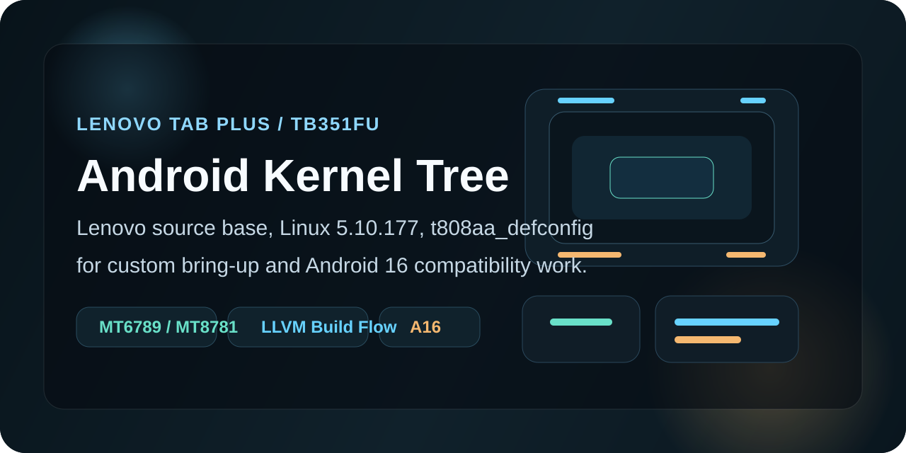

<p align="center">
  
</p>

# Android Kernel Tree for Lenovo Tab Plus TB351FU

This repository hosts the Linux kernel source tree currently being used for the Lenovo Tab Plus `TB351FU` bring-up work.

It is based on Lenovo's published open-source kernel release and is being reworked for custom development, testing, and Android 17 compatibility work around the `TB351FU` platform. The current focus is practical device bring-up, not a final production-ready Android 17 kernel release.

> [!NOTE]
> This tree is shared for educational and development use. Credit for the initial platform source belongs to Lenovo and the original upstream Linux / Android kernel contributors whose work this tree builds on.

## Current Status

- Base source: Lenovo open-source release for the `TB351FU` platform
- Kernel version: Linux `6.12.15` (Android GKI `6.12` base)
- Primary defconfig: `arch/arm64/configs/gki_defconfig` (Android GKI)
- Stock reference config: `arch/arm64/configs/stock_config`
- Toolchain direction in-tree: Clang / LLVM 19 (`LLVM=1`, `LLVM_IAS=1`)
- Ongoing work: cleanup, bring-up, and Android 17 compatibility adjustments for the TB351FU custom ROM stack

## Device Reference

This kernel is paired with the Lenovo Tab Plus `TB351FU` custom ROM effort. The values below come from the kernel tree itself and the matching public bring-up trees used with it.

| Item | Value |
| --- | --- |
| Device | Lenovo Tab Plus `TB351FU` |
| Board | `t808aa` |
| Platform family | MediaTek `MT6789` / `MT8781` bring-up target |
| Architecture | `arm64` primary, `arm` secondary compatibility |
| Kernel base | Linux `6.12.15` (Android GKI `6.12`) |
| Boot setup | Boot header v4, DTB included in boot image |
| ROM direction | Android 17 / Evolution X bring-up |
| Related hardware features in the public trees | Dolby hooks, Lenovo pen support, virtual A/B, AVB-enabled layout |

## What Is In This Tree

- Lenovo-sourced kernel base for the TB351FU platform
- MediaTek platform support for the active bring-up target
- OEM-facing drivers and platform-specific integration points used by the stock software base
- The Android GKI `6.12` base (`gki_defconfig`) and the stock kernel configuration reference (`stock_config`)

## Build Reference

This tree is not trying to replace the full Android build environment documentation. The commands below are a practical starting point for people already working inside an AOSP or LineageOS environment with the required toolchains available.

```bash
export ARCH=arm64
export SUBARCH=arm64

make O=out LLVM=1 LLVM_IAS=1 gki_defconfig
make -j"$(nproc)" O=out LLVM=1 LLVM_IAS=1
```

A GKI-style build via the Android kernel build system is also supported:

```bash
build/build.sh build.config.gki.aarch64
```

If you are building through a full Android tree, use the same kernel path and defconfig that the paired device tree expects:

- `TARGET_KERNEL_SOURCE := kernel/lenovo/TB351FU`
- `TARGET_KERNEL_CONFIG := gki_defconfig`

## Repository Pointers

- [arch/arm64/configs/gki_defconfig](arch/arm64/configs/gki_defconfig): Android GKI `6.12` defconfig used as the build base
- [arch/arm64/configs/stock_config](arch/arm64/configs/stock_config): stock Lenovo kernel configuration reference
- [build.config.gki.aarch64](build.config.gki.aarch64): GKI-oriented build configuration reference
- [android/abi_gki_aarch64_lenovo](android/abi_gki_aarch64_lenovo): ABI symbol list used for Lenovo-oriented GKI module compatibility work

## Scope And Intent

The goal of this repository is to make the published Lenovo kernel source more useful for community development on the `TB351FU`, especially for:

- recovery bring-up
- Evolution X / Android 17 bring-up and experimentation
- debugging boot and hardware initialization issues
- educational study of the platform kernel layout

This does **not** mean every subsystem is already validated for daily-driver use on Android 17. Expect ongoing changes as bring-up progresses.

## Credits

- Lenovo, for publishing the original open-source kernel base used here
- Linux kernel contributors and Android kernel maintainers upstream
- LineageOS and the Android aftermarket development community for bring-up patterns, tooling, and debugging workflows

## Related Repositories

- Device tree: <https://github.com/helllopratik/android_device_lenovo_tb351fu>
- Vendor tree: <https://github.com/helllopratik/android_vendor_lenovo_tb351fu>
- Recovery tree: <https://github.com/helllopratik/twrp_device_lenovo_TB351FU>
- TB351FU dev page: <https://helllopratik.github.io/tb351fu/>
